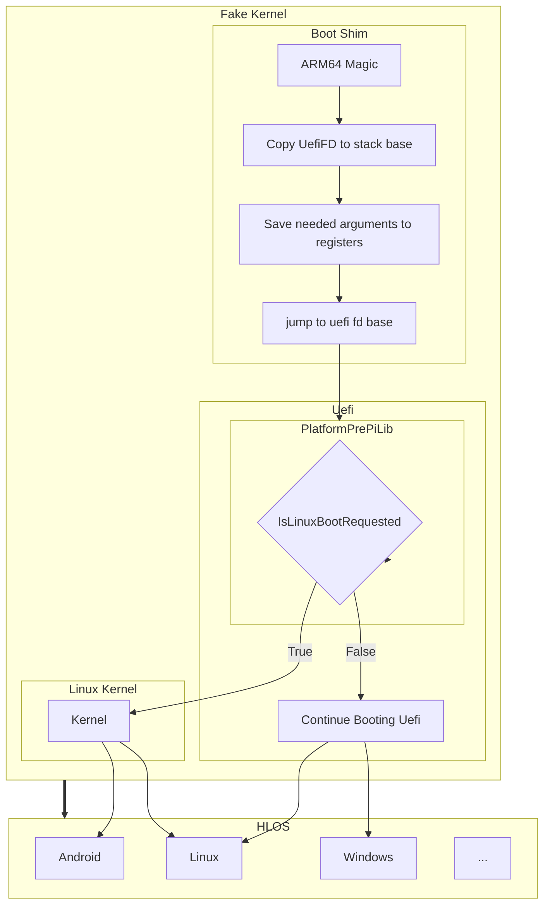

## This Repo Is Based On [SurfaceDuoPkg](https://github.com/Woa-Project/SurfaceDuoPkg/)

### Thanks for [Gustave](https://github.com/gus33000)'s instructions!

# [Project Mu](https://microsoft.github.io/mu/) UEFI Implementation for Devices on Snapdragon™ Platforms.

## Build 

### Minimum System Requirements

- At least 2 cores x86_64 processor running at 2Ghz or higher implementing the X86 ISA with 64 bit AMD extensions (AMD64) (Currently, building on any other ISA is not supported. In other words, do. not. build. this. on. a. phone. running. android. please.)
- SSD
- A linux environment capable of running below tool stack:
  - Bash
  - Python 3.10 or higher (python3.10, python3.10-venv, python3.10-pip)
  - mono-devel
  - git-core, git
  - build-essential
  - PowerShell Core 7
  - clang38 (or higher), llvm, ggc-aarch64-linux-gnu
- Exported CLANG38_BIN environment variable pointing to LLVM 10 binary folder
- Exported CLANG38_AARCH64_PREFIX variable equalling to aarch64-linux-gnu-

### Build Instructions

- Clone this repository to a reasonable location on your disk (There is absolutely no need to initialize submodules, stuart will do it for you later on)
- Run the following commands in order, with 0 typo, and without copy pasting all of them blindly all at once:

1. Setup Base environment

```
./setup_env.sh
pip install --upgrade -r pip-requirements.txt
```

*Alternatively, use docker if you don't have Ubuntu 22.04 environment*

```
docker build -t mu:v1 .
docker run -it mu:v1 -v ./:/build/
```

*Then finish the following process in docker environment*

2. Build UEFI & Generate Android Boot Image
> Usage: build_uefi.sh -d \<target-device\>  
- For sm8150:
  ```
  ./build_uefi.sh -d <target-name>
  ```

- For sm7125:
  ```
  ./build_uefi_atoll.sh -d <target-name>
  ```

- For sm7325:
  ```
  ./build_uefi_kodiak.sh -d <target-name>
  ```

- For sm8550:
  ```
  ./build_uefi_kailua.sh -d <target-name>
  ```

- You will see Build/xxxxPkg/\<target-device\>.img if it builds successfully.

## Target list

### *SM8150*

| Device             | Target name            | DSDT Support    | Maintainers                                        |
|--------------------|------------------------|-----------------|----------------------------------------------------|
| ASUS ROG2          | asus-I001DC            | ✅              | [Ww](https://github.com/Idonotkno)                 |
| Axon Stage 5G      | kakao-pine             | ❌              | [AKA](https://github.com/AKAsaliza)                |
| BlackShark 2       | blackshark-skywalker   | ❌              | NONE                                               |
| BlackShark 2 Pro   | blackshark-darklighter | ❌              | NONE                                               |
| HTC 5G Hub         | htc-rtx                | ❌              | NONE                                               |
| LG G8              | lg-alphaplus           | ✅              | [Yanhua](https://github.com/yanhua-tj)             |
| LG G8S             | lg-betalm              | ✅              | [J0SH1X](https://github.com/J0SH1X)                |
| LG G8X             | lg-mh2lm               | ✅              | [Molly Sophia](https://github.com/MollySophia)     |
| LG V50             | lg-flashlmdd           | ✅              | [AKA](https://github.com/AKAsaliza)                |
| LG V50S            | lg-mh2lm5g             | ✅              | [AKA](https://github.com/AKAsaliza)                |
| Meizu 16T          | meizu-m928q            | ❌              | NONE                                               |
| Meizu 16s          | meizu-m971q            | ❌              | NONE                                               |
| Nubia RedMagic 3   | nubia-nx629j           | ❌              | NONE                                               |
| Nubia RedMagic 3S  | nubia-nx629jv1s        | ❌              | NONE                                               |
| Nubia Mini 5G      | nubia-tp1803           | ✅              | [Alula](https://github.com/alula)                  |
| OnePlus 7          | oneplus-guacamoleb     | ❌              | NONE                                               |
| OnePlus 7 Pro      | oneplus-guacamole      | ✅              | [Waseem Alkurdi](https://github.com/WaseemAlkurdi) |
| OnePlus 7T Pro     | oneplus-hotdog         | ✅              | [sunflower2333](https://github.com/sunflower2333)&[Morc](https://github.com/TheMorc)|
| OnePlus 7T Pro 5G  | oneplus-hotdogg        | ✅              | NONE                                               |
| OPPO Reno 10X      | oppo-op46c3            | ❌              | NONE                                               |
| OPPO Reno ACE      | oppo-pclm10            | ✅              | [sunflower2333](https://github.com/sunflower2333)  |
| Qcom QRD 855       | qcom-msmnile           | ✅              | sunflower2333                                      |
| Realme X3          | realme-rmx2086         | ❌              | NONE                                               |
| Samsung Galaxy S10 | samsung-beyond1qlte    | ✅              | [Ww](https://github.com/Idonotkno)                 |
| Smartisan Pro 3    | smartisan-aries        | ❌              | NONE                                               |
| Xiaomi 9           | xiaomi-cepheus         | ✅              | [qaz6750](https://github.com/qaz6750)              |
| Xiaomi Hercules    | xiaomi-hercules        | ✅              | [Ww](https://github.com/Idonotkno)                 |
| Xiaomi K20 Pro     | xiaomi-raphael         | ✅              | [sunflower2333](https://github.com/sunflower2333)  |
| Xiaomi Mix3 5G     | xiaomi-andromeda       | ✅              | [sunflower2333](https://github.com/sunflower2333)  |
| Xiaomi Mix Alpha u2| xiaomi-avenger         | ❌              | NONE                                               |
| Xiaomi Pad 5       | xiaomi-nabu            | ✅              | [Map220v](https://github.com/map220v)              |
| Xiaomi Poco X3 Pro | xiaomi-vayu            | ✅              | [Degdag](https://github.com/degdag)                |


### *SM7125*

| Device             | Target name            | DSDT Support    | Maintainers                                        |
|--------------------|------------------------|-----------------|----------------------------------------------------|
| Qcom QRD 720       | qcom-atoll             | ✅              | sunflower2333                                      |
| Xiaomi Note 9S     | xiaomi-miatoll         | ❌              | Icesito                                            |
| Xiaomi Note 10 Pro | xiaomi-sweet           | ❌              | [dopaemon](https://github.com/dopaemon)            |


### *SM7325*

| Device             | Target name            | DSDT Support    | Maintainers                                        |
|--------------------|------------------------|-----------------|----------------------------------------------------|
| Qcom QRD 778       | qcom-kodiak            | ✅              | Ayu                                                |


### *SM8550*
> Comming soon...  

| Device             | Target name            | Support         | Maintainers                                        |
|--------------------|------------------------|-----------------|----------------------------------------------------|
| Nubia RedMagic 8Pro| nubia-nx729j           | ❌              | BigfootACA                                         |

## Acknowledgements

- Gustave Monce and his [SurfaceDuoPkg](https://github.com/Woa-Project/SurfaceDuoPkg/)
- Andrei Warkentin and his [RaspberryPiPkg](https://github.com/andreiw/RaspberryPiPkg)
- Sarah Purohit
- [Googulator](https://github.com/Googulator/)
- [Ben (Bingxing) Wang](https://github.com/imbushuo/)
- Samuel Tulach and his [Rainbow Patcher](https://github.com/SamuelTulach/rainbow)
- BigfootACA and his [SimpleInit](https://github.com/BigfootACA/simple-init)
- [Renegade Project](https://github.com/edk2-porting/)
- Lemon ICE

## License 
All code except drivers in `GPLDriver` directory are licensed under BSD 2-Clause.  
GPL Drivers are licensed under GPLv2 license.


## Boot Chain
